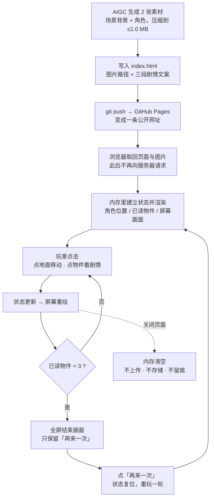

# 技术设计文档｜夜班 SOLITUDE

> 项目：夜班 SOLITUDE（仓库：Soren2077）
> 阶段：Day 5 技术方案 · 日期：2026-09-20
> 上游依据：`PRD.md`（Day 4 产品需求）、`research.md`（Day 3 需求研究）

## 1. 技术路线

### 1.1 结论（一句话）

**单文件 HTML + 原生 JavaScript / CSS，用 DOM 定位与 CSS 过渡实现角色移动，
图片作为场景与角色素材，托管在 GitHub Pages —— 无后端、无数据库、无构建工具。**

### 1.2 候选方案四维比较

| 方案 | 学习成本 | 线上持久化（本项目） | 费用 | 排错难度 |
|---|---|---|---|---|
| **① 单文件 HTML + 原生 JS/CSS** ★ 选用 | 最低。只需 HTML/CSS/JS 基础，不学新工具 | 无需求（PRD 已砍存档）；若以后要加，用浏览器 localStorage，零成本零后端 | ¥0 | 最低。F12 直接点中角色和物件，看到位置与尺寸；改一行样式刷新即见 |
| ② HTML + Canvas 2D | 中。多学坐标换算、绘制循环、点击命中检测 | 同上 | ¥0 | 中。画面全在画布上，F12 选不中元素，只能靠日志和肉眼 |
| ③ Vite + React | 中高。多学 npm、构建流程、组件、状态管理 | 同上 | ¥0 | 中高。源码不等于运行代码，多一层映射才能定位问题 |
| ④ Phaser 游戏引擎 | 高。引擎 API、场景、精灵、物理系统 | 同上（引擎自带存档插件，仍存本机） | ¥0 | 高。引擎内部行为不可见，报错信息离业务代码很远 |

> **"线上持久化"这一列四套方案全部打平**，因为它对本项目是"无需求"：
> `PRD.md` 第 6 节 C 组已明确砍掉账号登录与存档读档。
> 把这个维度列出来，是为了说明它**不影响本次选型**，而不是假装它有意义。

### 1.3 为什么选 ①

| # | 理由 |
|---|---|
| 1 | **需求决定工具，不是反过来**。本作品的交互只有两个动作：点地面移动、点物件。这不需要逐帧渲染循环 —— 而 Canvas 与游戏引擎的核心价值恰恰在于渲染循环 |
| 2 | **零构建 = 部署就是 `git push`**。没有依赖安装、没有打包、没有产物目录，出错的地方直接少一半。而 GitHub Pages 本身就是"仓库里有啥就发啥"，两者天然咬合 |
| 3 | **排错成本最低**。角色就是一个 ``，物件就是三个 `<div>`。位置不对，F12 点一下就看到坐标；Canvas 里出问题只能盯着一整张画布猜。Day 7 时间紧，这条最值钱 |
| 4 | **页面体积几乎全由图片决定**。没有框架代码，体积预算全留给美术，直接服务于 `PRD.md` 验收第 8 条（总体积 ≤5 MB） |

### 1.4 为什么不选另外三套

| 方案 | 淘汰原因 |
|---|---|
| ② Canvas 2D | 要自己写绘制循环与"点到了哪个物件"的命中检测 —— 这些是引擎已解决的低层问题，而我们只有 1 张背景 + 1 个角色，不值当 |
| ③ Vite + React | React 的价值在"大量会变化的状态和可复用组件"，本作品总共只有 4 个交互状态。多一层构建 = 多一类错误 |
| ④ Phaser | 能力远超需求，且引擎自带数百 KB 体积，直接挤占图片预算 |

### 1.5 本方案的已知短板（如实记录）

| 短板 | 代价 | 是否会撞上 |
|---|---|---|
| 复杂动画、粒子效果会撞天花板 | 迁移到 Canvas 需重写"交互渲染层"，图片素材与文案不用重做 | 不会。`PRD.md` 第 6 节已砍掉行走动画等需求 |
| 窄屏手机上 DOM 定位需要额外缩放处理 | Day 6 用"等比缩放容器"解决，是已知套路 | 会撞上，已有解法 |
| 单文件会越写越长 | 加分区注释；超过约 800 行可拆成 `style.css` + `game.js`，**仍不需要构建工具** | 可能，成本与风险都低 |

## 2. 项目结构

```
Soren2077/
├─ index.html            ← 唯一入口：结构 + 样式 + 逻辑
├─ images/               ← 素材目录（Day 7 创建）
│  ├─ scene.jpg          ← 场景背景（AIGC 生成，≤1.0 MB）
│  └─ player.png         ← 角色（AIGC 生成，≤1.0 MB）
├─ PRD.md                ← Day 4 产品需求
├─ research.md           ← Day 3 需求研究
├─ TECH_DESIGN.md        ← 本文件（Day 5）
├─ AGENTS.md             ← 协作规则（Day 1）
├─ .gitignore            ← 忽略名单（含 .env）
└─ .workbuddy/           ← AI 工作笔记，非项目产物
```

**约定**：素材文件名一律**英文小写 + 连字符**，不用中文、不用空格（原因见第 8 节"部署的坑"）。

## 3. 数据对象及字段

本项目没有数据库。以下是**游戏运行时内存里记住的信息** —— 刷新页面即全部归零。

### 3.1 运行时状态（内存，随页面关闭清空）

| 字段 | 类型 | 说明 | 初值 |
|---|---|---|---|
| `player.x` / `player.y` | 数值 | 角色当前位置，用相对场景容器的百分比表示（便于不同屏幕等比缩放） | 场景下方居中 |
| `target.x` / `target.y` | 数值 | 本次移动的落点 | 同一初值 |
| `isMoving` | 布尔 | 是否正在移动中 | false |
| `hotspots[]` | 数组 | 3 个可互动物件，从静态配置读入 | 见 3.2 |
| `hotspots[i].read` | 布尔 | 该物件是否已被读过 | false |
| `readCount` | 数值 | 已读物件数量 | 0 |
| `card` | 物件 id 或空 | 当前正在显示的文字卡片属于哪个物件（空 = 未显示） | 空 |
| `isEnded` | 布尔 | 是否已进入结束画面 | false |

### 3.2 静态配置（写死在页面里，随页面一起下发）

| 字段 | 类型 | 说明 |
|---|---|---|
| `id` | 字符串 | 唯一标识，如 `washer` |
| `name` | 字符串 | 显示名，如"还在转的洗衣机" |
| `x` / `y` | 数值 | 在场景中的位置（百分比） |
| `story` | 字符串 | 点击后弹出的文字（≤150 字） |

### 3.3 明确不存在的数据

| 类别 | 为什么没有 |
|---|---|
| 用户数据（账号、昵称、邮箱） | `PRD.md` 第 6 节 C 组砍掉账号系统 |
| 存档与进度 | `PRD.md` 第 6 节 C 组砍掉存档，刷新即重来 |
| 服务端数据与数据库表 | 本项目无后端 |
| 埋点与统计数据 | 未要求，且会引入第三方依赖 |

**刷新页面 = 全部回到初值。这是设计，不是缺陷。**

## 4. API 列表

**本项目没有 API。**

API 是"前端向后端点菜的窗口"。本作品没有后端程序，所有内容在用户打开页面时一次性下发完毕，
之后不再与服务器通信。没有后厨，就没有窗口。

浏览器与托管服务之间**仅有的两次交互**（属静态资源请求，不构成本项目定义的 API）：

| 请求 | 方向 | 说明 |
|---|---|---|
| `GET index.html` | 浏览器 → 托管服务 | 取页面骨架 |
| `GET images/*` | 浏览器 → 托管服务 | 取图片素材 |

**本项目不产生任何上传类请求**（无 POST / PUT / DELETE），因此不存在"用户数据被发到服务器"的路径。

## 5. 数据流

### 5.1 数据流图

> 本图所示的载体：**单文件 HTML + 原生 JavaScript / CSS**（技术路线见 1.1）。



### 5.2 文字说明（一句话答"数据从哪来、到哪去"）

**数据从哪来**：两类来源 ——
① **AIGC 生成的图片文件**（场景背景 + 角色共 2 张），在 Day 7 之前做好、压到每张 ≤1.0 MB 以内；
② **写死在页面里的三段剧情文案**，随页面一起下发。

**经过什么**：玩家打开链接 → 浏览器一次性取回页面与图片 → 页面脚本在内存里建立状态
（角色位置、已读物件）→ 渲染成屏幕上的画面。

**到哪去**：到**玩家的屏幕**。玩家的每次点击只改变**浏览器内存里**的状态，让屏幕重新渲染一次；
点齐 3 个物件后进入结束画面。**全程不上传、不存储、不联网**，关掉页面即全部消失。

## 6. 错误处理

本项目无服务端，因此**不存在"服务器错误"这一大类**；风险集中在素材与交互边界上。

| 可能出的问题 | 表现 | 处理方式 |
|---|---|---|
| 图片加载失败（网络中断 / 路径写错） | 画面空白 | 场景容器给兜底背景色；图片带 `alt` 文本；卡片区提示"素材加载失败，请刷新" |
| 素材超预算导致加载慢 | 白屏数秒 | 主要手段是事前压缩（`PRD.md` 验收第 8 条 ≤5 MB）；开场页的"开始"按钮天然承担等待 |
| 点在不该点的地方 | 玩家以为坏了 | 地面点击只在合理范围内响应；点到已读物件仍会重新弹出卡片，**不出现"点了没反应"** |
| 移动目标越界 | 角色走出画面 | 目标坐标先收敛到容器边界内再移动（对应 `PRD.md` 验收第 2 条） |
| 重复点击已读物件 | —— | 卡片重新显示相同内容，物件高亮消失表示已读（`PRD.md` 已定） |
| 结束画面出现后继续点击 | —— | 全屏遮罩拦截，移动与物件交互全部停用，只留"再来一次" |
| 浏览器控制台出现红色报错 | `PRD.md` 验收第 7 条不过 | Day 7 交付前按 F12 逐项检查，报错清零 |
| 旧浏览器不支持某些特性 | 页面错乱 | 只用基础能力（DOM、CSS 过渡），不使用实验性 API |

## 7. 环境变量

**本项目没有环境变量。**

环境变量用于给**运行在服务器上的程序**注入配置（例如数据库密码、第三方服务密钥）。
本作品：没有服务端程序、没有密钥、没有需要按环境切换的配置，因此不需要环境变量。

> 附注：仓库里存在一个空的 `.env` 文件，它是 Day 2 为实测忽略规则而创建的，**与配置无关**，
> 且已被 `.gitignore` 永久排除在仓库之外。

## 8. 部署

### 8.1 方式：GitHub Pages

仓库 Settings → Pages → Source 选 `Deploy from a branch` → 分支 `main`、目录 `/ (root)` → Save。
等待 1–2 分钟后，得到形如 `https://soren-yeyey.github.io/Soren2077/` 的公开网址。

**为什么可行**：GitHub Pages 只能托管静态文件（HTML / CSS / JS / 图片），不会运行服务端代码 ——
而本作品正好就是纯静态，两者天然匹配。

### 8.2 平台额度（来源：GitHub 官方文档 "About GitHub Pages"）

| 项 | 值 | 性质 |
|---|---|---|
| 站点大小 | ≤1 GB | 软限制 |
| 带宽 | 100 GB/月 | 软限制 |
| 单次部署构建 | ≤10 分钟 | 硬限制 |
| 单文件 | >100 MB 会被 Git 拒绝 | 硬限制 |
| 私有仓库 | 免费版不支持 | —— |

"软限制"指超出后不会立刻停站，但可能被限流。本作品占用约 2–3 MB，离上限极远。

### 8.3 部署要注意的坑

| 坑 | 说明 |
|---|---|
| 部署有延迟 | 推完不是立刻生效，通常等 1–2 分钟 |
| 路径大小写敏感 | 托管在 Linux 服务器上，`Scene.JPG` 与 `scene.jpg` 会被当成两个文件。素材名统一小写英文 |
| 中文文件名与空格 | 在不同浏览器上容易出问题，一律避免 |
| 缓存 | 改了图片但浏览器仍显示旧图 —— 调试时用无痕窗口或强制刷新 |
| 文档也会被发布 | 根目录下的 `PRD.md` / `TECH_DESIGN.md` / `AGENTS.md` 会随站点一起公开可访问。由于仓库本身就是 Public，这不改变任何东西的公开范围 |

## 9. 迁移与扩展注意事项

### 9.1 方案变化时，哪些文件会受影响

| 变化 | 受影响文件 | 工作量 |
|---|---|---|
| 替换场景图或角色图 | `images/` 下对应文件（可能连带页面里的宽高比设定） | 极小 |
| 修改剧情文案 | `index.html` 里三段文案 | 极小 |
| 增加第 4 个物件 | `index.html` 的配置区 + 可选样式 | 小 |
| 拆成 `style.css` + `game.js` | 移动代码，不改变行为，仍不需要构建工具 | 小 |
| 增加声音 | 新增音频文件 + 自动播放策略处理；**体积预算需重算**（`PRD.md` 5 MB 上限） | 中 |
| 增加存档 | 优先浏览器 localStorage（本机、零后端）；要跨设备才需要后端 + 数据库 | 小 → 大 |
| 增加第二个场景 | 素材翻倍 + 状态里引入"当前场景" + 场景切换逻辑 | 中 |
| 换用 Canvas 或游戏引擎 | **重写交互渲染层**；图片素材与文案不用重做 | 大 |

### 9.2 迁移纪律

1. **素材先压缩再入库**。Git 会记住每一个版本，大文件一旦提交进历史，后续清理很麻烦。
2. **改动前先提交一次**，保证每一步可单独回退（对应 `AGENTS.md` 第七节的安全回退）。
3. **一旦加入任何"需要联网"的功能**，"无后端、无 API、无环境变量"这三个前提就失效了 ——
   那时必须回头更新本文件第 4、7 节，而不是假装它们还成立。

## 10. 参考来源

- GitHub Docs · About GitHub Pages（站点额度、静态限制）
- 通用 Web 性能测量结论：4G 网络（约 20 Mbps）下 5 MB 页面的真实加载耗时约 4–6 秒；
  图片通常占页面体积的 50–70%
- 查证日期：2026-09-20
